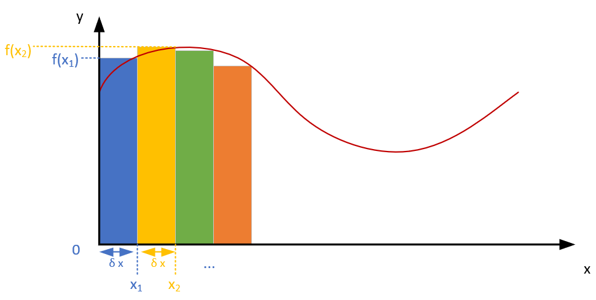

# Intro Exercise

## Assignment

### Cheatsheet

Make a cheatsheet (./cheatsheet.md) of programming concepts from C# to Python

### Python introductory examples

Make a Python script for at least 3 of the following exercises:

1. What is the sum of all natural numbers between 0 and 10 000 divisible by 7 or 9?

    For example: 7,9,14,18 are those numbers between 0 and 20. Their sum is 48.

1. The row of Lucas starts with 2 and 1 and each subsequent number is the sum of the two numbers preceding the number. What is the sum of all odd numbers in the row of Lucas smaller than 4 000 000?

    Hint the row of Lucas starts with: 2, 1, 3, 4, 7, 11, ...

1. Make a class BinaryCounter which consists of 4 Leds, and define methods to represent the value it represents in binary, as a decimal and as a hexadecimal. Also provide a method to increment and decrement the value of the BinaryCounter.

    For example the value 7 is represented by led3: 0, led2: 1, led1: 1, led0: 1

1. Define a Line class which consists of two Points. Points are defined by x and y coordinate values. Provide a method in the Line class which returns the length of the Line.
1. A definite integral is defined by the area under the function. The Riemann sum is a approximation of this definite integral, by summing the areas of the rectangles which are defined by a chosen delta x. Delta x is the width of the approximate rectangle and the function value f(x) is the length of that rectangle. Write a function which calculates the Riemann sum for a given function for a given interval.

    
